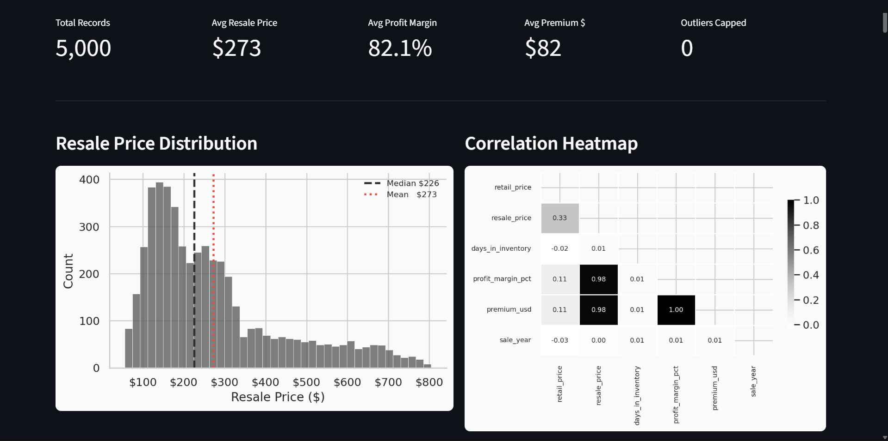
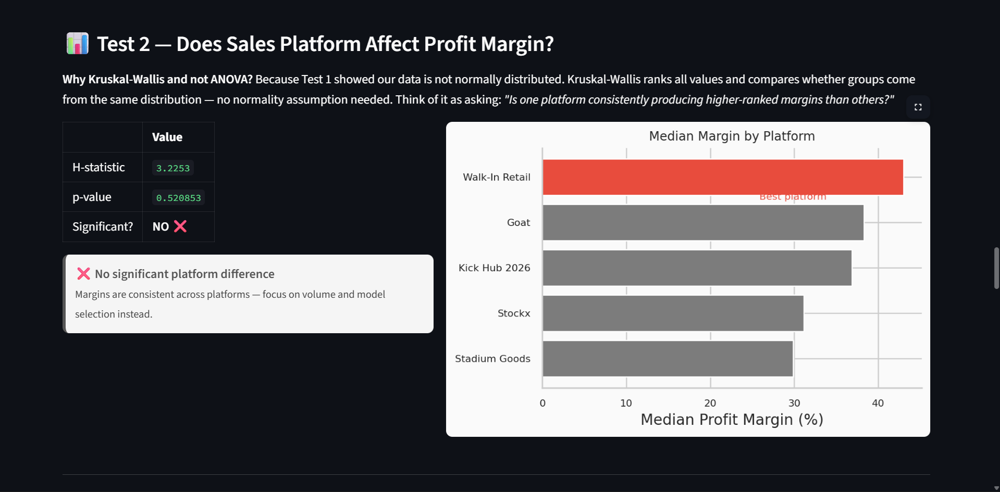
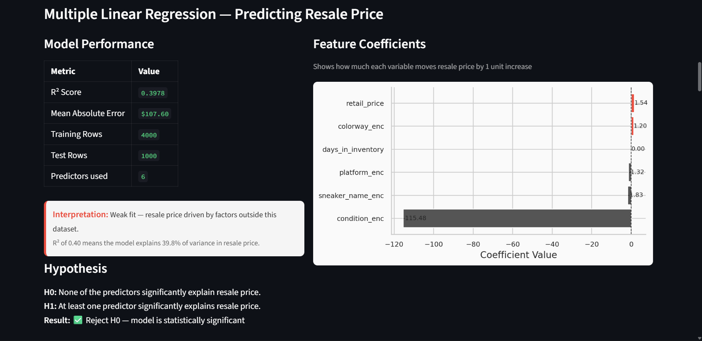
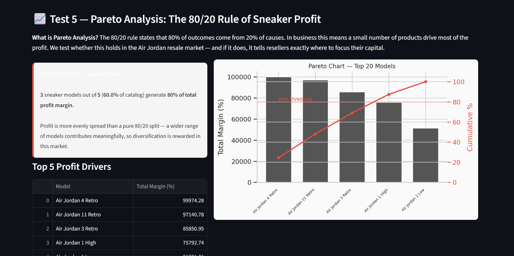

# 👟 Air Jordan Resale Intelligence Dashboard

> **Scarcity Pays. Patience Doesn't.**
> A data-driven analysis of the Air Jordan sneaker resale market (2023–2026) powered by 7 statistical tests, machine learning segmentation, and an interactive Streamlit dashboard.

[](https://python.org)
[](https://streamlit.io)
[](https://scikit-learn.org)
[](LICENSE)
[](https://aj-sneaker-dash.streamlit.app)

---

## 📌 Overview

The Air Jordan resale market moves billions of dollars annually — yet most participants operate on instinct rather than data. This project applies rigorous statistical analysis to 5,000+ real sneaker resale transactions to answer three questions every reseller gets wrong:

- **When** is the optimal time to sell?
- **Where** (which platform) maximises margin?
- **What** — which models and conditions drive the most profit?

The findings challenge conventional wisdom: hold time has zero statistical effect on margin, platform choice is statistically insignificant, and sneaker **condition** is 75× more powerful a price driver than any other variable in the dataset.

---

## 🖥️ Live Demo

🔗 **[View the live dashboard →](https://airjordan-resale-intelligence.streamlit.app/)**

Upload the dataset from [Kaggle](https://www.kaggle.com/datasets/abdullahmeo/air-jordan-sneaker-market-and-resale-data2023-2026) in the sidebar to explore all features.

---

## ✨ Features

### 📊 Statistical Analysis (7 Tests)
| Test | Purpose | Result |
|------|----------|--------|
| Shapiro-Wilk | Normality check | Right-skewed — median preferred over mean |
| One-Way ANOVA | Hold time vs margin | F=1.16, p=0.28 — not significant |
| Kruskal-Wallis | Platform vs margin | H=3.23, p=0.52 — not significant |
| Spearman ρ | Retail vs resale price | ρ=0.34 — weak positive relationship |
| Chi-Square | Condition vs platform | V=0.026 — independent |
| Pareto Analysis | Model profit concentration | 3/5 models drive 80% of profit |
| Multiple Regression | Resale price prediction | R²=0.40, MAE=$107 |

### 🤖 Machine Learning
- **K-Means Clustering** — segments market into Entry, Mid, and Premium price tiers
- **Multiple Linear Regression** — predicts resale price from 6 independent features
- **ABC Classification** — ranks models by sales volume contribution

### 📈 Dashboard Features
- Interactive sidebar filters (platform, inventory tier, price tier, date range)
- Monthly trend chart with peak annotations and MoM/YoY growth table
- Correlation heatmap using Pearson coefficients
- Actual vs Predicted scatter with perfect-fit diagonal
- Pareto chart with dual-axis cumulative percentage overlay
- Key Insights cards with actionable business recommendations

---

## 🛠️ Tech Stack

| Category | Technology |
|----------|-----------|
| Language | Python 3.10+ |
| Dashboard | Streamlit |
| Data Manipulation | Pandas, NumPy |
| Visualisation | Matplotlib, Seaborn |
| Statistics | SciPy |
| Machine Learning | Scikit-Learn |
| Deployment | Streamlit Cloud |

---

## 🚀 Installation

### Prerequisites
- Python 3.10 or higher
- pip package manager

### Steps

```bash
# 1. Clone the repository
git clone https://github.com/maneet-999/airjordan-resale-intelligence.git
cd airjordan-resale-intelligence

# 2. Create a virtual environment (recommended)
python -m venv venv
source venv/bin/activate        # Mac/Linux
venv\Scripts\activate           # Windows

# 3. Install dependencies
pip install -r requirements.txt

# 4. Run the dashboard
streamlit run air_jordan_dashboard.py
```

The dashboard will open automatically at `http://localhost:8501`

---

## 📖 Usage

1. **Download the dataset** from [Kaggle](https://www.kaggle.com/datasets/abdullahmeo/air-jordan-sneaker-market-and-resale-data2023-2026)
2. **Upload the CSV** using the sidebar file uploader
3. **Apply filters** — platform, inventory tier, price tier, date range
4. **Explore sections** — scroll through 8 analytical sections
5. **Export insights** — expand the MoM Growth Table for raw trend data

## 📁 Folder Structure

```
airjordan-resale-intelligence/
│
├── air_jordan_dashboard.py     # Complete pipeline — cleaning, stats, ML, dashboard
├── requirements.txt            # Python dependencies
├── README.md                   # Project documentation
├── CONTRIBUTING.md             # Contribution guidelines
├── LICENSE                     # MIT License
├── .gitignore                  # Git ignore rules
│
└── assets/                     # Screenshots for README
    ├── dashboard_overview.png
    ├── statistical_tests.png
    ├── regression_output.png
    └── pareto_chart.png
```

---

## 📸 Screenshots

### Dashboard Overview


### Statistical Tests


### Regression Output


### Pareto Analysis


> **To add screenshots:** Take screenshots of your live dashboard, save them in the `assets/` folder, and the images above will render automatically on GitHub.

---

## 📐 Key Findings

### Finding 1 — The Hype Tax
Mean profit margin (74.8%) is 39 percentage points above the median (35.6%). Shapiro-Wilk (p=0.000000) confirms right skew — a small cluster of ultra-limited releases inflates the average. **The median is the honest benchmark.**

### Finding 2 — Hold Time is a Myth
ANOVA (F=1.16, p=0.28) and Kruskal-Wallis both fail to reject H₀. Days in inventory shows a regression coefficient of 0.00. **Hold time has zero measurable effect on margin.**

### Finding 3 — Condition Dominates Everything
Regression coefficient for condition = -115.48 — 75× larger than any other predictor. **Deadstock vs Used is the single most important buying decision a reseller makes.**

### Finding 4 — Three Models Drive the Market
Pareto analysis: Air Jordan 4 Retro, Air Jordan 11 Retro, Air Jordan 3 Retro generate 80% of total profit margin across the catalog.

---

## 🔮 Future Improvements

- [ ] **Sentiment Analysis** — scrape Twitter/Reddit for hype signals pre-release
- [ ] **Price Forecasting** — ARIMA or Prophet time series model for monthly price prediction
- [ ] **Size Premium Analysis** — test whether certain sizes command higher premiums
- [ ] **Geographic Analysis** — resale price variation by region/country
- [ ] **Real-time Data Pipeline** — connect to StockX API for live price feeds
- [ ] **Random Forest Model** — upgrade from linear regression for non-linear relationships
- [ ] **Portfolio Simulator** — input capital amount, get optimal model allocation

---

## 🤝 Contributing

Contributions are welcome. Please read [CONTRIBUTING.md](CONTRIBUTING.md) first.

```bash
# Fork the repository
# Create your feature branch
git checkout -b feature/your-feature-name

# Commit your changes
git commit -m "Add: your feature description"

# Push to the branch
git push origin feature/your-feature-name

# Open a Pull Request
```

---

## 📄 License

This project is licensed under the MIT License — see [LICENSE](LICENSE) for details.

---

## 👤 Contact

**Your Name**
- GitHub: [@maneet-999](https://github.com/maneet-999)
- LinkedIn: [linkedin.com/in/maneet_gupta999] (linkedin.com/in/maneet-gupta999)
- Email: 2543maneet@gmail.com

---

## 🙏 Acknowledgements

- Dataset: [Air Jordan Sneaker Market & Resale Data 2023–2026](https://www.kaggle.com/datasets/abdullahmeo/air-jordan-sneaker-market-and-resale-data2023-2026) by abdullahmeo on Kaggle
- Built as a competition submission for data analytics

---

<p align="center">
  Made with 📊 and statistical rigour
</p>
